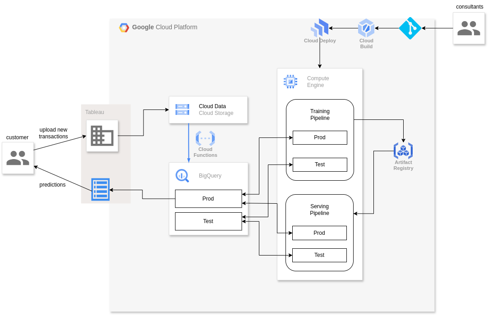

# Predicting Sales of Items in Shops

## Objective
Objective of this project is to develop a POC of an ML-based system for predicting monthly sales of items in shops.
We will explore and evaluate the performance of different ML-methods to address this problem.

## Installation and Setup
1. Create a Python 3.11 based environment of your preference and install the repository as a package (`pip install -e .`).
2. Adjust the rootpath and the names of raw data files for the 'local' environment inside: [config.yml](config/config.yml).

## Data

### Raw Data
Raw data comprise following tables and fields:
- shop_list: ['shop_name', 'shop_id]
- item_list: ['item_name', 'item_id', 'item_category_id']
- category_list: ['item_category_name', 'item_category_id']
- transaction: ['date', 'shop', 'item', 'price', 'amount' ]

The `RawData` class provided by [data_utils.py](src/data_utils.py) module loads the raw data upon instantiation, after fixing some data schema issues (in transactions table, 'shop', 'item' -> 'shop_id', 'item_id').

To ease data analysis and interpretability, the 4 tables are merged into one single table (`df_daily`), data types are simplified for better computational efficiency (float64->float32, int64->int32), date strings are converted to datetime objects, a 'monthly_period' (%YYYY-%mm, from now on Mperiod) field is created, and the implausible (negative) and outliers found in price and amount data are cleaned. For the outlier removal, two different options were tested:
1. removing outliers only for a preselected train period (and not for the validation period)
2. removing outliers for the entire time period at once. 
After some elaboration, the second approach was adopted.
All methods for raw data preprocessing are provided by the `data_tools.RawData` class.

### Exploratory Data Analysis on the Raw Data
See [EDA.ipynb](notebooks/EDA.ipynb). After the processing of the raw data, the temporal trends in transaction counts and total sale amounts are analyzed, revealing both a yearly trend and a seasonality. The EDA also reveals that the amount of sales across shops and categories are strongly variable. Shop is a necessary feature anyway, since we want to predict sales of items in individual shops, but from this analysis, we can see that category can be included as a feature in the model.

### Creation of the monthly data

Since our objective is to predict the monthly total sales, the raw (daily) data needs to be aggregated to a monthly form. **Assuming** that all items are available in all shops, this table should provide monthly aggregate data for each item-shop-Mperiod combination. For this purpose, following steps are taken (by data_tools.MonthlyData.prep_monthly_data method):

#### Creating a monthly 'item sales' table
With MonthlyData.create_items_df_monthly method:
- create a total item sales table by performing a grouby (on shop_id, item_id, Mperiod) & aggregate operation, by summing the amounts, averaging prices, and taking the first of the item_category_id's (for each item_id there is only one item_category_id anyway)  
- create a table with all possible shop_id-item_id-Mperiod combinations
- merge the two tables
- Fill the NaN's (which arise for shop-item-Mperiod combinations that never occurred in the past transactions)
    - 'amount': replacing with 0's (meaning 0 sales).
    - item_category_id: by merging with a item_id - item_category_id table
    - price: we try to restore sequentially with:
        - shop_id-item_id averaged price
        - if remaining: item_id averaged price
        - if remaining: category averaged price
        - if remaining: global average price

#### Creating a monthly 'categorie sales' table
With MonthlyData.create_categories_df_monthly method:
- similar the first step of creating the items table, here we create a total category sales table by performing a grouby (on shop_id, item_category_id, Mperiod) & aggregate operation, by summing the amounts and averaging prices.
- create a talbe with all possible shop_id-item-category_id-Mperiod combinations
- merge the two tables
- Fill the NaN's (which arise for shop-category-Mperiod combinations that never occurred in the past transactions), for
    - 'amount': replacing with 0's (meaning 0 sales).
This table contains no other fields that require imputation of missing values.

#### Merging 'category sales'  into 'item sales'
This way, we end up with two amount columns:
- item amounts: how many items were sold for each shop-item-Mperiod combination. This is going to be our label anyway.
- category amounts: how many items were sold for each shop-category-Mperiod combination. For the forecasting, we won't have this data, but it's lag-features can be calculated and used fo inference.

#### Indexing with Mperiod
Mperiod ('monthly-period') is set as the new index of the monthly_data.

### Introducing time features
Year and month, as derived from monthly_period.

### Introducing timeseries features
With data_tools.MonthlyData.create_ts_features method.

#### Create lagged features
With data_tools.MonthlyData.add_lag_features method.
For 'price', 'amount_item', and 'amount_cat', we introduce their lags (here specified as the first 3). Note that as the Mperiod is the new index, a lag of 1 means one month of lag.  

#### Moving averages
With data_tools.MonthlyData.add_ma_features method.
For the 1-month lagged versions of, 'price', 'amount_item', and 'amount_cat', (i.e, 'price-l1', 'amount_item-l1', and 'amount_cat-l1'), we introduce 2 months moving averages. We do this for the lagged versions of features, and not the original features, as for the forecasting, we will have only the lagged versions of the amount_ features.

#### Final features
Finally, we end up with the following features:
shop_id, item_id, item_category_id, year, month, price_l1, price_l2, price_l3, amount_item_l1, amount_item_l2, amount_item_l3,	amount_cat_l1, amount_cat_l2, amount_cat_l3, price_l1_ma2, amount_item_l1_ma2, amount_cat_l1_ma2

## Model Training Pipeline
### Data Preparation
model_tools.PredictorData.prep_data method, activated during instantiation of the PredictorData class automates the data preparation process described above. Note that, for saving time, if refresh_monthly and refresh_ts_features arguments are not specified to be True, the previously prepared and these data will be loaded from previously saved parquet files.

### Model creation, training and validation
In this project, families of models are defined as classes in separate modules, which define their own specialized methods, and attributes, such as the transformer pipelines specifically suited to each of these model families. These model classes in turn  are derived from a BasePredictor class provided by the model_tools module, which provides the shared methods and attributes relevant for all model classes. 

Here, we have experiemented with 3 models so far:
- linear_models.LinearRegressor
- nn_models.TF_NN_Predictor
- tree_models.LGBM_Predictor

At this testing phase, training and validation is performed with jupyter notebooks. 3 Approaches has been tested so far:
- linear models: For their generalization power and ease of interpretability, linear regression family of models is often a must-try step for a regression problem. Here we tried ElasticNet, but the results are not convincing.
- tree models: Tree-based models are known for their accuracy, although they are easy to overfit without careful validation. Here we tried LGBM, which showed decent performance.
- neural network models: neural nets are usually not preferred for tabular data, but given their endless flexibility, one can always explore different architectures that might prove to be specifically suitable for the problem at hand. Here we experimented with simple architectures with 3 and 4 dense layers.

#### Transformer Pipeline
- The NN and Linear regression approaches:
    - require the categorical variables to be encoded. The id's are in this category. Because of their high cardinality, target encoding was preferred.
    - require the numerical values to be normalized. Here MinMaxScaler was preferred
- The tree based approaches do need transformation of categorical and numerical features
- For all models, a cyclic encoder was included in the transformer to account for the seasonality of the month feature

## Forecasting Pipeline
For the forecasting, we need to
- create the feature table (X) for the next month. For this purpose:
    - shop_id, item_id, item_category_id: copied from the previous month
    - year, month: constructed for the month for which a forecast is needed:
    - price_l1, price_l2, price_l3, amount_item_l1, amount_item_l2, amount_item_l3,	amount_cat_l1, amount_cat_l2, amount_cat_l3: shifted from the previous month
    - price_l1_ma2, amount_item_l1_ma2, amount_cat_l1_ma2: recalculated
- transform the features 
- load a previously saved model
- use model.predict() method to obtain the predictions

## Design of a Solution Architecture
Here is a proposed solution architecture for fully pruductinizing the system:

